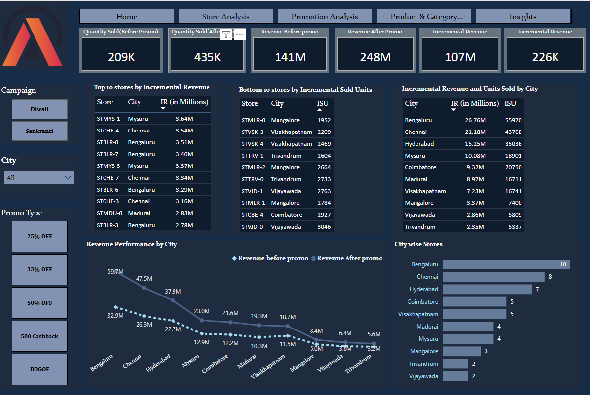
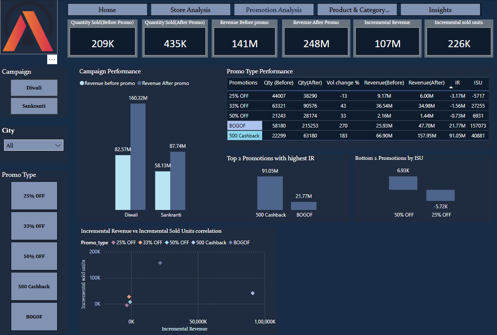
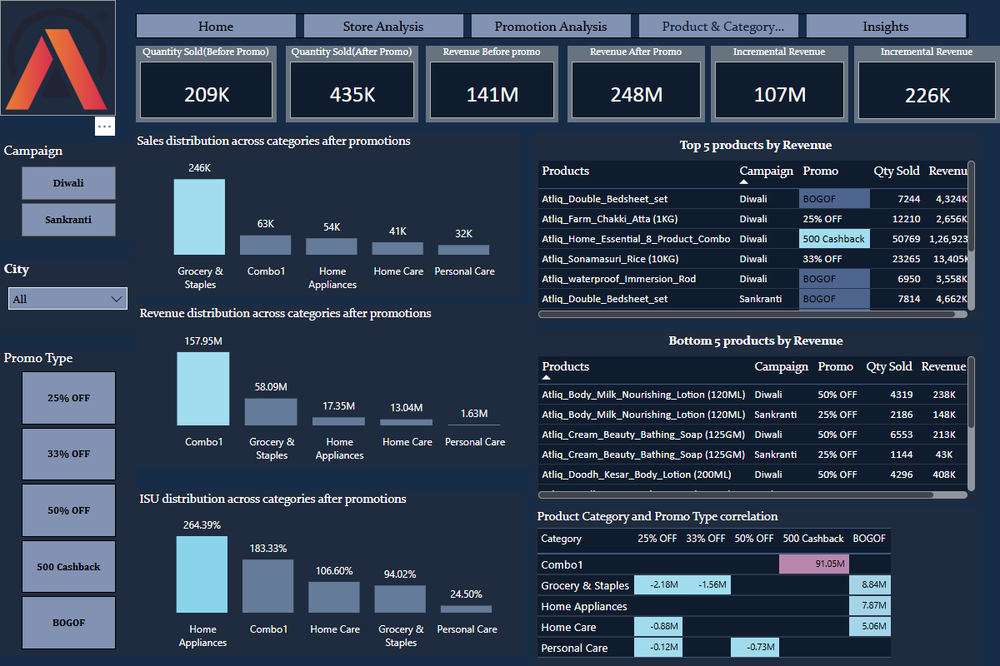
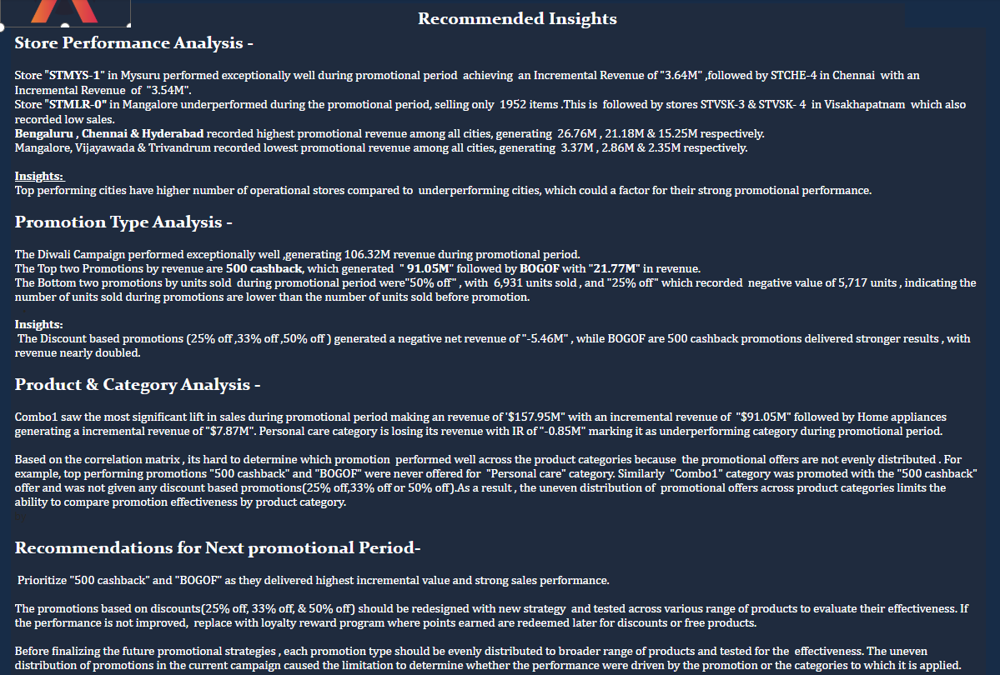

**AtliQ Mart--Promotion Effectiveness & Revenue Analysis**

**Domain**: FMCG **Function:** Sales & Promotions

An interactive PowerBI dashboard analysing Promotional campaigns, Sales and Revenue from the dataset. This dashboard provides key insights on how different promo types (percentage discounts, flat cashback, and BOGOF) actually impact revenue and sales. helping the business make informed decisions for their next promotional period.

**Project Overview:**

AtliQ Mart is a retail giant with over 50 supermarkets in the southern region of India. All their 50 stores ran a massive promotion during the Diwali 2023 and Sankranti 2024 (festive time in India) on their AtliQ branded products. Now the sales director wants to understand which promotions did well and which did not so that they can make informed decisions for their next promotional period.

**Objectives:**

The business ran five promo types - 25% OFF, 33% OFF, 50% OFF, 500 Cashback, and BOGOF (Buy One Get One Free) - across multiple product categories and campaigns, and needed to know

- Store Performance Analysis- How stores performed across the promotional period.
- Promotions Analysis- measure the effectiveness of promo types in terms of Incremental revenue(IR) and Incremental units sold(ISU)
- Product & category analysis- Which product categories and individual products responded well to the promotions

**Tools Used:**

| Microsoft Power BI | Dashboard development & visualization |
| ------------------ | ------------------------------------- |
| Power Query        | Data cleaning & Transformation        |
| DAX                | Business KPI's                        |
| CSV                | Source Dataset                        |
| MySQl              | SQL based report generation           |

**Dataset:**

The dataset contains 4 CSV files:

| **File**          | **Description**                                                                                                                                                                         |
| ----------------- | --------------------------------------------------------------------------------------------------------------------------------------------------------------------------------------- |
| **fact_events**   | **1,500 transaction-level rows -Base price,** **promo_type,** **quantity_sold(before_promo),** **quantity_sold(after_promo) including foreign keys for campaigns, products and stores** |
| **dim_campaigns** | **Campaign details - campaign_id,campaign_name (e.g., Diwali, Sankranti),Start date ,End date.**                                                                                        |
| **dim_products**  | **Product-level attributes - product_name, category,product_code**                                                                                                                      |
| **dim_stores**    | **Store-level details - store ID, city**                                                                                                                                                |

**Data Transformation**

- Promoted headers
- Converted date fields into Date format
- Created discounted_price custom column
- Converted discounted_price and Revenue into Decimal format
- Assigned proper numeric data types
- Created custom columns for enhanced reporting

**Data Modeling:**

The data model follows a star schema, with **fact_events** as the central fact table connected to three dimension tables:

- **dim_products** (dimension) - **product_code**
- **dim_campaigns** (dimension) - **campaign_id**
- **dim_stores** (dimension) - store_id
- **fact_events** (fact table) - transaction-level records, joined to each dimension table via foreign keys (**product_code, campaign_id, store_id)**

**Key Calculations:**

Discounted price (Power Query)

Each promo type requires a different logic -a flat % cut(25%,33%,50%), a cashback(500 cashback) and BOGOF(Buy one get one free).

For BOGOF, considered quantity_sold(after_promo) as total units shipped including paid+free, so revenue for BOGOF is calculated by rounding the quantity up and dividing by 2 ,to get the actual number of paid units. For example, the quantity sold(after_promo) is 79, dividing by 2 gives 39.5, which rounds up to 40 - meaning 40 units were paid for and 39 were given free.

**Measures:**

- **Revenue(before_promo)**
- **Revenue(after_promo)**
- **Quantity sold(before_promo)**
- **Quantity sol(after_promo)**
- **Incremnetal Revenue(IR)**
- **Incremental units sold(ISU)**

**Dashboard preview- Store Analysis**
### Store Analysis

### Promotion Analysis

### Product & Category Analysis

### Business Insights & Impact

**Dashboard Features:**

- **KPI Cards**
- **Interactive Slicers and Filters**
- **Revenue Analysis**
- **Product and Category Analysis**
- **Promotion Analysis**
- **Product Category and Promotion Analysis**
- **Performance of stores by City**
- **Dynamic charts**
- **Recommended Insights**
